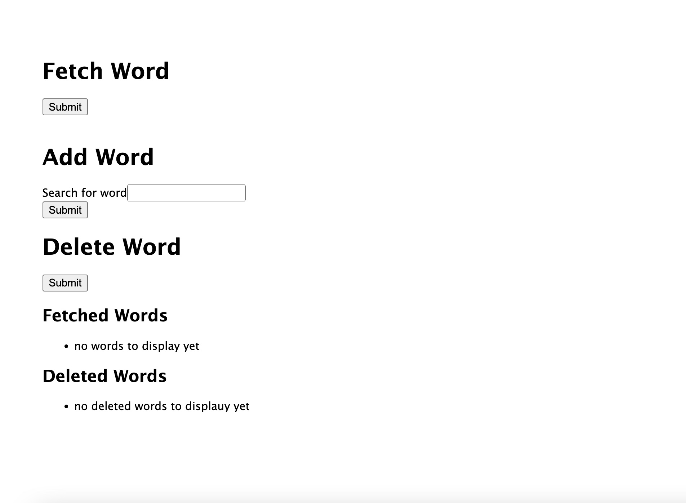

## The Rounds Challenge

To install with https:

`git clone https://github.com/chrisdel101/the-rounds-challenge.git`

To run:

`cd the-rounds-challenge`

`npm i && npm start`

### Needs work before production

- basic api calls work but responses are handled with only basic care - either it works or it doesn't type situation.
- This would need to be improved so user knows what is actually happening when the buttons are clicked - example is on delete, the response is not helpful currently.
- error handling is very basic. There are some more sophistaced errors on the server, but those are not passed anywhere currently.
- interface is too bare bones and in fact has no styles at all. This is an obvious area for improvement

### Current interface visual

